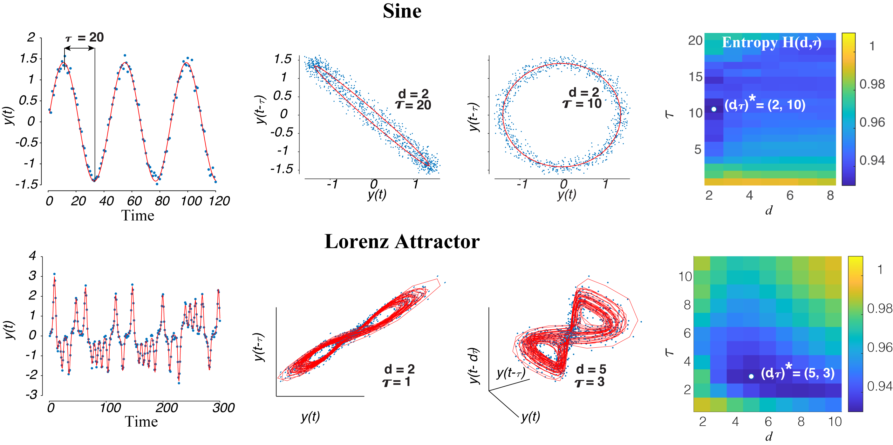
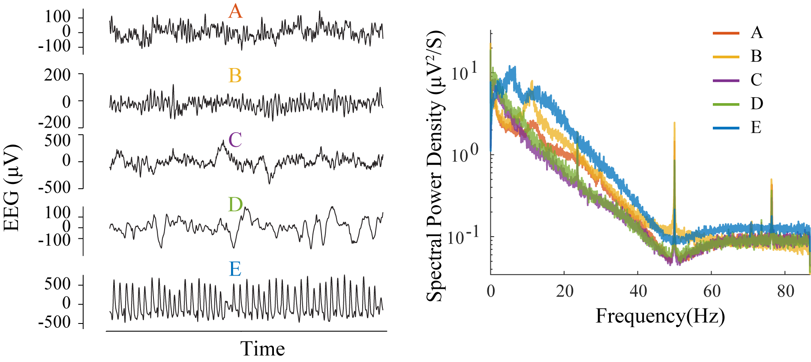
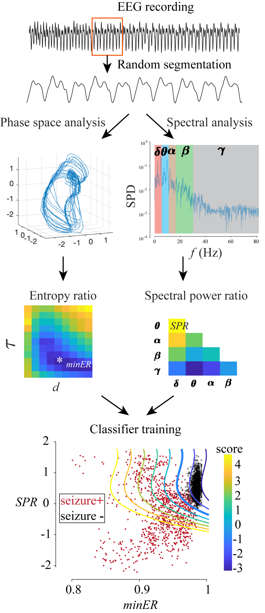
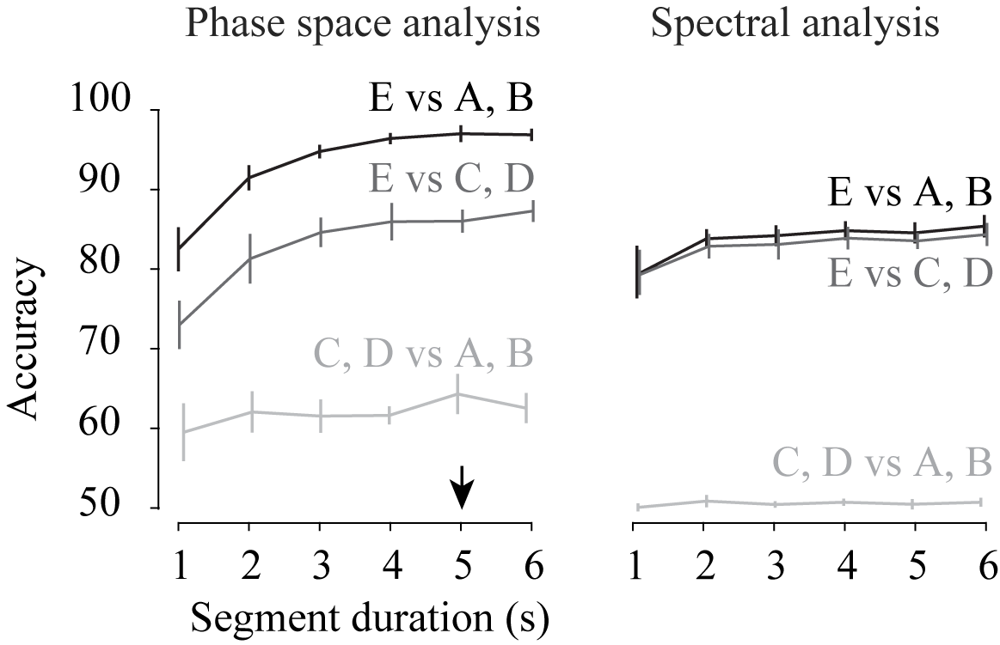

**In this [article](https://github.com/wangjing0/Entropy-is-all-she-cares/blob/main/entropy2021.pdf), we looked into the EEG signal from the perspective of a dynamical system. We argue that normal and abnormal brain activities can be 
* visualized in the phase space to the best interest of experimenters. 
* manifested in the changes of dynamics, and most importantly. 
* captured by an intrinsic measure, namely entropy, of the system.
* 
(To be appear in IEEE Artificial Intelligence and Pattern Recognition 2021)**

### 1, A mini intro to delayed time embedding in time series analysis
 **Linear and Chaotic system**
 

  

### 2. Example EEGs and their spectrograms

  

### 3. Analysis pipeline

  

### 4. Compare outcomes
 

  

